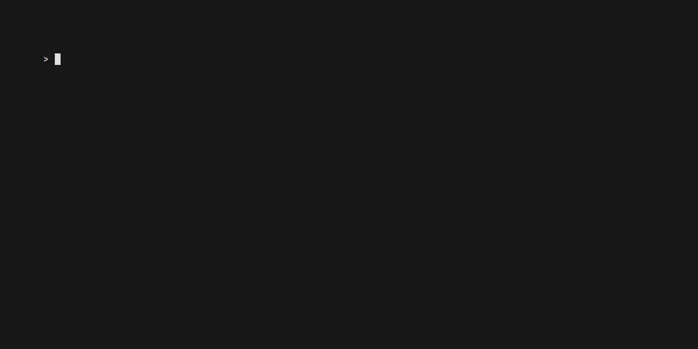
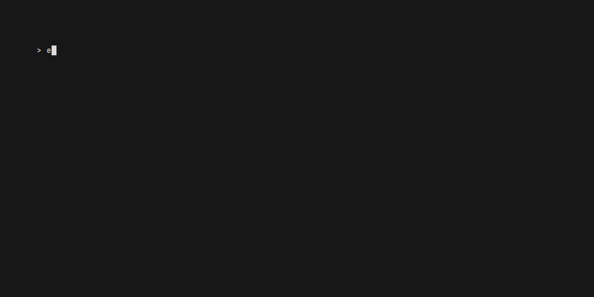

# TALL-E: **T**erminal **A**bstraction **L**ayer **L**ibrary
The 'E' is just a subtle nod to WALL-E.

## Previews

#### Colors Example



#### Styles Example



> [!NOTE]
> These are just previews and do not represent the actual appearance and behavior in all environments.

For examples, refer to the [examples](./examples) directory in the repository.

## Getting Started
Clone the repository with:
```shell
git clone https://github.com/ScriptExec/talle.git
```
or add it as a submodule to your existing repository:
```shell
git submodule add https://github.com/ScriptExec/talle.git path/to/talle
```

### Build Requirements
CMake 3.24+

> [!WARNING]
> 32-bit platforms are **not supported**

#### Install required packages
Ubuntu
```shell
sudo apt install build-essential cmake ninja-build gdb
```

## Building
To build the library use CMake via an IDE or manually, with:
```shell
cmake --preset=<PRESET> && cmake --build --preset=<PRESET>
```
Replace `<PRESET>` with one of:
- `x64-<SYSTEM>-debug`
- `x64-<SYSTEM>-release`

and replace `<SYSTEM>` with a value from:
- windows
- linux
- macos

## CMake Projects
If your project uses CMake, you can add the following lines to your CMakeLists.txt, to link against the library:
```cmake
# You can optionally provide these options:
set(TALLE_BUILD_EXAMPLES OFF) # default: ON
set(TALLE_STATIC OFF) # default: ON
set(TALLE_INSTALL OFF) # default: ON

add_subdirectory("path/to/talle")
target_link_libraries(${PROJECT_NAME} PRIVATE talle)
```
